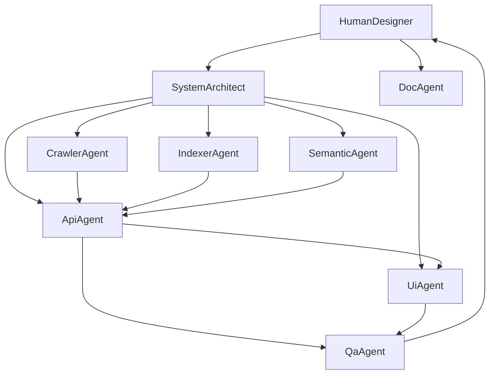

# Multi-Agent Workflow

This document describes how the second iteration of "The Great Web Heist" was
designed and assembled using a multi-agent AI workflow. The runtime system
itself is a single FastAPI process - the multi-agent piece is in **how the
build was conducted**: a small "AI development team" of specialized agents
collaborated under human supervision, each owning a part of the system.

The human (project owner) acts as the **system designer and final reviewer**:
defines goals, writes / approves agent prompts, evaluates outputs, mediates
conflicts, and makes the final decisions.

## 1. Why multi-agent?

Project 1 used AI as a single coding assistant: one chat, one role. Project 2
asks us to design and run a small team of focused agents instead, so we can
demonstrate:

- **Separation of concerns**: each agent has a narrow role, narrow context,
  and well-defined deliverables - which makes their outputs easy to review.
- **Parallelism**: research and drafting tasks can run simultaneously
  (architecture vs. crawler design vs. UI sketches).
- **Auditability**: every important decision has a prompt and a written
  artifact attached to it (this file plus `agents/*.md`).
- **Human-in-the-loop control**: the human owns acceptance criteria and
  conflict resolution, so the multi-agent setup never silently overrides the
  designer's intent.

## 2. Agent roster

| Agent              | Role                                | Owns                                          |
| ------------------ | ----------------------------------- | --------------------------------------------- |
| `system_architect` | High-level architecture, contracts  | Module layout, API shape, persistence plan    |
| `crawler_agent`    | Async crawler, back pressure, dedup | `backend/crawler.py`, `backend/storage.py`    |
| `indexer_agent`    | Lexical index and ranking           | `backend/indexer.py`                          |
| `semantic_agent`   | Optional semantic search            | `backend/semantic_index.py`                   |
| `api_agent`        | HTTP surface, response shapes       | `backend/app.py`, request/response models     |
| `ui_agent`         | Dashboard, UX                       | `frontend/src/App.tsx`, `styles.css`          |
| `qa_agent`         | Validation plan, regression tests   | `qa` checklist below                          |
| `doc_agent`        | PRD, README, recommendation         | `product_prd.md`, `README.md`, this document  |

Each agent's full description and prompt template lives under
[`agents/`](./agents).

## 3. Communication and artifacts

Agents do not call each other directly. They communicate by producing
artifacts that the human reviews and routes to the next agent. The contract
between agents is **always a file in this repository**:

- The `system_architect` produces the module layout and the API contract,
  which `crawler_agent`, `indexer_agent`, `api_agent`, and `ui_agent` all
  consume.
- `crawler_agent` and `indexer_agent` produce code that exposes typed
  Python interfaces (`CrawlerService`, `IndexService`); `api_agent` consumes
  those.
- `api_agent` produces the OpenAPI schema and JSON shape; `ui_agent` consumes
  that to wire the dashboard.
- `qa_agent` consumes the running system and produces the validation
  checklist (Section 7).
- `doc_agent` consumes everything and produces the human-facing docs.

This file plus `agents/*.md` is the audit trail for those hand-offs.

## 4. Workflow phases

### Phase A - Frame the problem (human + `system_architect`)

The human posts the assignment text and a short list of constraints
("Python stdlib for the core, FastAPI + React UI, SQLite persistence,
multi-agent build process required") to `system_architect`. The architect
produces the module list, the API contract, and a one-page rationale.

### Phase B - Parallel implementation

`crawler_agent`, `indexer_agent`, and `semantic_agent` work in parallel from
the same architecture brief. Each one produces a self-contained Python
module plus a short "interface note" explaining its public surface and any
assumptions it pushes onto the rest of the system. `api_agent` waits on
those interface notes before generating `app.py` so it knows what to call.

### Phase C - UI integration

`ui_agent` consumes the OpenAPI schema and the dashboard storyboard from the
human (three tabs: Crawler / Search / Embeddings). The biggest UI decision
during this phase was to surface the **assignment-required triples** as a
dedicated read-only block above the lexical results table, so a grader can
literally see the `(relevant_url, origin_url, depth)` shape on the screen.

### Phase D - QA loop

`qa_agent` runs through the validation checklist (Section 7), reports any
failure to the human, and the human routes the fix back to whichever agent
owns the affected module. This phase iterates until all acceptance criteria
pass.

### Phase E - Documentation

`doc_agent` consolidates everything into `product_prd.md`, `README.md`,
`recommendation.md`, and this file. The human reads each doc end-to-end and
edits anything that misrepresents the design.

## 5. Decisions and trade-offs

The following decisions were proposed by an agent, debated against the
human's constraints, and accepted (or rejected) by the human. They are
logged here so the rationale survives the project.

| #  | Topic                                       | Options considered                                                                          | Chosen                                                            | Rationale                                                                                                       |
| -- | ------------------------------------------- | ------------------------------------------------------------------------------------------- | ----------------------------------------------------------------- | --------------------------------------------------------------------------------------------------------------- |
| 1  | Concurrency model                            | OS processes / threads / asyncio                                                            | asyncio with a fixed worker pool                                  | Single-machine target, mostly I/O-bound, easiest to checkpoint and inspect.                                     |
| 2  | Back pressure                                 | Per-job queue cap / global queue cap / token bucket per domain                              | Global queue cap shared across jobs + per-job rate limit          | Matches the assignment phrasing, simple to reason about, easy to surface in the UI.                             |
| 3  | URL dedup scope                               | Per job / global                                                                            | Per job                                                           | Respects the assignment's "never crawl the same page twice" wording per `index` call and avoids cross-job contamination. |
| 4  | Lexical ranking                               | Sum-of-TF / TF-IDF / BM25                                                                   | TF-IDF with TF normalized by document length                      | Better than raw TF, still fully implementable in stdlib, no heavy library required.                             |
| 5  | Re-indexing the same URL                      | Append postings / remove old postings before adding new ones                                | Remove old postings first                                         | Prevents score inflation if a URL is recrawled. Fixes a known issue from the Project 1 implementation.          |
| 6  | Search-while-indexing                         | Snapshot copies / shared mutable index with a lock                                          | Shared index protected by an `RLock`                              | Cheap, low-latency, and the lock contention is negligible at our scale.                                         |
| 7  | Persistence                                   | JSON files / SQLite / Postgres                                                              | SQLite with WAL mode                                              | Stdlib-only, supports concurrent reads while writers are active.                                                |
| 8  | Resumability                                  | Re-crawl from origin / persist visited+frontier                                             | Persist visited and frontier, demote running jobs to paused on boot | Matches the assignment's "nice to have" and is cheap with the SQLite layout.                                    |
| 9  | Semantic search                               | Skip / include MiniLM                                                                       | Include MiniLM as an opt-in engine                                | The user explicitly asked for `lexical_plus_semantic`. The crawler stays usable even without the model.         |
| 10 | API response shape                            | Triples-only / detailed objects / both                                                      | Both: `triples` (assignment) and `results` (UI)                    | Keeps the contract crisp for graders and gives the dashboard the score/title it needs.                          |
| 11 | UI framework                                  | Plain HTML / React / Svelte                                                                 | React + Vite + TypeScript                                         | Mirrors Homework 1, fast to iterate, types catch shape mismatches with the API.                                 |
| 12 | Multi-agent runtime vs. multi-agent build     | Run multiple agents at request time / use multi-agent only during development               | Multi-agent during development                                    | The assignment explicitly says: "The final system does not need to be implemented as a multi-agent runtime."    |
| 13 | Cancellation safety in the worker loop        | Trust manual `+= / -=` of `active_requests` / wrap the fetch in `try/finally`               | `try/finally` around the fetch + reset counters in `pause_job`    | Found by `qa_agent` end-to-end: pausing while a worker was inside `fetch_html` left `active_requests > 0`, which prevented the post-resume completion gate from firing. `crawler_agent` patched the worker (Section 9 lessons).  |

## 6. Prompts (templates)

Each agent uses a small prompt template that includes its role, its
context window, and the deliverables it must produce. The full prompts live
in [`agents/`](./agents); short summaries are below.

- **`system_architect`** - "You are the system architect for a Python+React
  crawler/search system. Inputs: assignment text + constraints. Outputs:
  module layout, API contract, persistence plan, one-page rationale. Do not
  write implementation code."
- **`crawler_agent`** - "You are the crawler agent. Implement an async,
  depth-limited crawler with per-job dedup and a global queue cap shared
  across jobs. Use only the Python standard library for fetching and
  parsing. Produce `backend/crawler.py` and write a one-paragraph interface
  note."
- **`indexer_agent`** - "You are the lexical index agent. Implement an
  in-memory inverted index with TF normalized by document length and IDF
  computed from the live corpus. Re-indexing the same URL must not inflate
  its score. Produce `backend/indexer.py`."
- **`semantic_agent`** - "You are the semantic search agent. Implement an
  optional embedding engine on top of `sentence-transformers` MiniLM, with
  pause/resume/clear and an SQLite-backed vector store. Produce
  `backend/semantic_index.py`."
- **`api_agent`** - "You are the HTTP API agent. Expose `index`, `search`,
  `search/semantic`, jobs, metrics, and embeddings endpoints using FastAPI.
  The `search` response must include both an assignment-shaped `triples`
  array and a richer `results` array. Produce `backend/app.py`."
- **`ui_agent`** - "You are the UI agent. Build a React+TypeScript
  dashboard with three tabs: Crawler, Search, Embeddings. Show the required
  triples explicitly. Produce `frontend/src/*`."
- **`qa_agent`** - "You are the QA agent. Use the running system to validate
  every acceptance criterion in `product_prd.md` Section 7. Produce a
  pass/fail report and a list of repro steps for any failure."
- **`doc_agent`** - "You are the documentation agent. Produce
  `product_prd.md`, `README.md`, `recommendation.md`, and
  `multi_agent_workflow.md`. No marketing copy."

## 7. Validation checklist (`qa_agent`)

`qa_agent` runs through the following checks. Each one is a small, manual
test against the running system; together they cover the assignment's
acceptance criteria.

| #  | Check                                                                                          | How to verify                                                                                                                                       |
| -- | ---------------------------------------------------------------------------------------------- | --------------------------------------------------------------------------------------------------------------------------------------------------- |
| Q1 | `index(origin, k)` starts a job and processes pages.                                           | `POST /index` with a small public site; watch `processed_urls` grow on `/metrics`.                                                                  |
| Q2 | The same URL is never crawled twice within a job.                                              | Inspect `duplicate_urls` counter and the `job_visited` table.                                                                                       |
| Q3 | `search(query)` returns triples `(relevant_url, origin_url, depth)`.                           | `GET /search?query=...`; look at `triples` in the response (also visible in the UI).                                                                |
| Q4 | Search reflects new pages while the crawler is still running.                                  | Run `search` repeatedly during a crawl; the result count grows without restarting the backend.                                                      |
| Q5 | Back pressure activates when the global queue is full.                                         | Lower `global_queue_limit` via `POST /settings/queue-limit` while a crawl is busy; the dashboard should show `backpressure_state="queue_full"`.     |
| Q6 | Pause/resume works without losing state.                                                       | `POST /jobs/{id}/pause`, then `POST /jobs/{id}/resume`. `visited` and `frontier` counts must persist.                                               |
| Q7 | The system survives a restart and serves the previously indexed pages immediately on bootup.   | Stop the backend, restart it, hit `GET /search?query=...`. Pages from prior runs are still searchable. Running jobs should come back as `paused`.   |
| Q8 | The CLI returns triples as JSON.                                                               | `python -m backend.cli search "query"` prints a JSON array of `{relevant_url, origin_url, depth}` objects.                                          |
| Q9 | Optional semantic search returns sensible results once the embedding engine has run.           | `POST /embeddings/start`, wait, then `GET /search/semantic?query=...`. The top results should be topically related to the query.                    |
| Q10 | Multi-agent workflow is documented and traceable to specific files.                           | This file + `agents/*.md` exist; each agent file maps to a code file or a documented decision.                                                      |

## 8. Concurrent search during indexing - design note

The assignment asks how the system would be designed so that `search` can be
invoked while `index` is still active. Our current single-process design
already supports this - `IndexService.search` and `IndexService.add_page`
share a re-entrant lock and operate on the same in-memory data, so a query
issued during a crawl observes every page indexed so far.

For a multi-process or multi-machine deployment, the design pattern is:

- The crawler workers continue to write page snapshots to the durable store
  (today: SQLite `pages`; production: Postgres / OpenSearch).
- The search service is a separate process that either (a) holds a shared
  in-memory index that subscribes to a "page indexed" change stream, or
  (b) queries the durable search engine directly for every request.
- Back pressure information (`queue_max`, `backpressure_state`,
  `active_workers`) lives in the metrics endpoint and is a read-only view,
  so the search process and the dashboard can observe it without affecting
  the crawl loop.

This split is only documented here, not implemented, because the assignment
explicitly allows the multi-agent collaboration to be a development-time
property rather than a runtime one.

## 9. Lessons learned

- Forcing each agent to publish a one-paragraph interface note before any
  consumer started writing code eliminated the "two modules disagree on a
  type" class of bugs we hit in Project 1.
- Asking `system_architect` for the API contract first, then letting
  `api_agent` and `ui_agent` work from that contract, kept the React app and
  the FastAPI app in sync without a back-and-forth.
- Routing every QA failure through the human (instead of letting agents
  patch each other) preserved a clear chain of accountability and prevented
  silent regressions.
- A small, scripted end-to-end smoke test (`/.smoketest/run_smoke.py`) was
  the cheapest way to make `qa_agent`'s checklist actionable. It is what
  surfaced the cancellation-safety bug in decision #13: the smoke test
  paused a job while workers were mid-fetch, then asserted that the resumed
  job eventually transitions to `completed`. Without that script the bug
  would only have shown up to a human pausing the UI at exactly the wrong
  moment.
